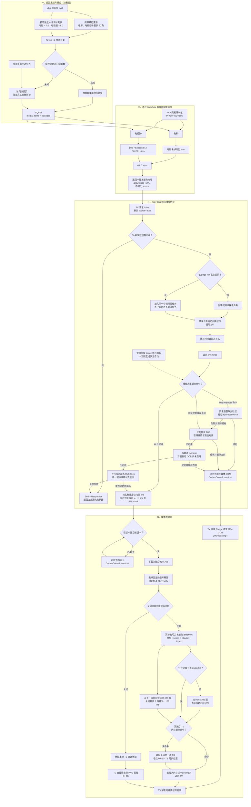

# STRM Proxy 完整数据链路总览

本文用一张图描述当前实现从资源发现、数据库持久化、WebDAV 暴露，到 `/play` 自动选择直连 MP4 或 HLS，以及 MPEG-TS 分片转发的完整链路。

图中的“包装”仅描述代码已经验证的数据布局和处理方式，不对上游采用这种格式的目的作判断。当前实现不解析 PNG 语义：M3U8 按固定前缀长度截取后解压，TS 则通过 MPEG-TS 的同步字节规律寻找真实载荷起点。

## 数据边界

- SQLite 保存媒体元数据、策略、电视剧分集路径，以及通用 `cache_entries` 中的长期播放决策和 30 秒失败结果；不保存影片内容。
- 播放页解析结果和还原后的 M3U8 默认在内存中缓存 5 分钟。
- `source=auto` 最近验证成功的播放方向默认长期保存在 SQLite；命名 HLS 按 URL fragment（如 `#iplay`）在实时候选中重新定位。管理页可以人工覆盖或清除同一条记录；名称消失、变得不唯一或获取失败时删除。
- 同一进程按 `page_url` 合并并发探索；客户端超时或断开不会取消共享任务，探索成功后仍会写入缓存。
- 所有来源失败时 `/play` 返回 `503`、`Retry-After` 和结构化错误，不生成错误视频。
- `/god` 返回的 MP4 地址不写入 SQLite 或 STRM；TOS 每次播放重新获取并验证，随后由 TV 直连 CDN。
- 登录 Cookie 只按域发送给 xlys，不发送给 MP4 或 TS CDN。
- 分片代理开启时，清洗后的 TS 使用全局内存 LRU 缓存；默认从当前播放位置向后预读约 600 秒、总容量最多 128 MiB，服务重启后清空。
- 分片代理关闭时，TV 直接请求上游 TS，本服务不承载视频流量。
- MP4 直连时，TV 使用 Range 请求媒体 CDN，本服务只承担解析和 302 跳转。
- 该过程不转码、不重新压缩，也不修改 MP4/TS 内部的音视频编码。

更详细的签名、线路选择、MP4 探测和包装还原说明参见[《从播放页面到 STRM：解析链路说明》](play-page-to-strm.md)。
