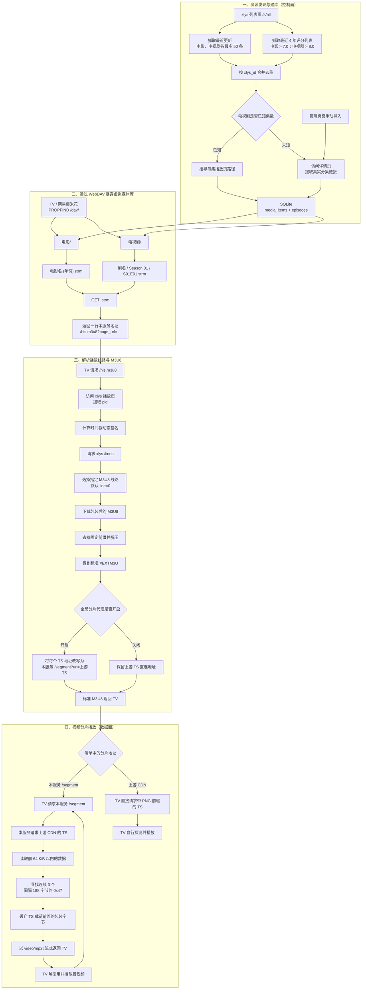

# STRM Proxy 完整数据链路总览

本文用一张图描述当前实现从资源发现、数据库持久化、WebDAV 暴露，到播放页解析、M3U8 还原和 MPEG-TS 分片转发的完整链路。

图中的“包装”仅描述代码已经验证的数据布局和处理方式，不对上游采用这种格式的目的作判断。当前实现不解析 PNG 语义：M3U8 按固定前缀长度截取后解压，TS 则通过 MPEG-TS 的同步字节规律寻找真实载荷起点。

## 数据边界

- SQLite 只保存媒体元数据、策略和电视剧分集路径，不保存影片内容。
- 播放页解析结果和还原后的 M3U8 默认在内存中缓存 5 分钟。
- 分片代理开启时，TS 不落盘也不缓存；每个分片由服务从上游获取、定位 MPEG-TS 起点后流式转发。
- 分片代理关闭时，TV 直接请求上游 TS，本服务不承载视频流量。
- 该过程不转码、不重新压缩，也不修改 TS 内部的音视频编码。

更详细的签名、线路选择和包装还原说明参见[《从播放页面到 STRM：解析链路说明》](play-page-to-strm.md)。
